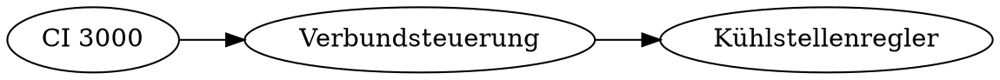
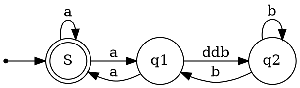

# To begin with


Normaler Test

*Kursiver Text*

**Fett gedruckter Text**

~~Durchgestrichen~~


# Überschrift 1

## Überschrift 2

Tabelle

| Tables   |       Are      |  Cool |
|----------|:-------------:|------:|
| col 1 is | left-aligned | $1600 |
| col 2 is | centered    |   $12 |
| col 3 is | right-aligned |    $1 |
&#124; 


    code

Syntax highlighted code:
```javascript
function fancyAlert(arg) {
  if(arg) {
    $.facebox({div:'#foo'})
  }
}
```

```python
def foo():
    if not bar:
        return True```    
```


Ignore Markdown foramtting: \*our-new-project\* to \*our-old-project\*.


[Link to Google!](http://google.com)


# GitHub specials:

@mentionUserName

@octocat :+1: This PR looks great - it's ready to merge! :shipit:


# Other

Trennlinie

------

Trennlinie vorbei

1. First ordered list item
2. Another item
   * Unordered sub-list. 
1. Actual numbers don't matter, just that it's a number
   1. Ordered sub-list
4. And another item.


